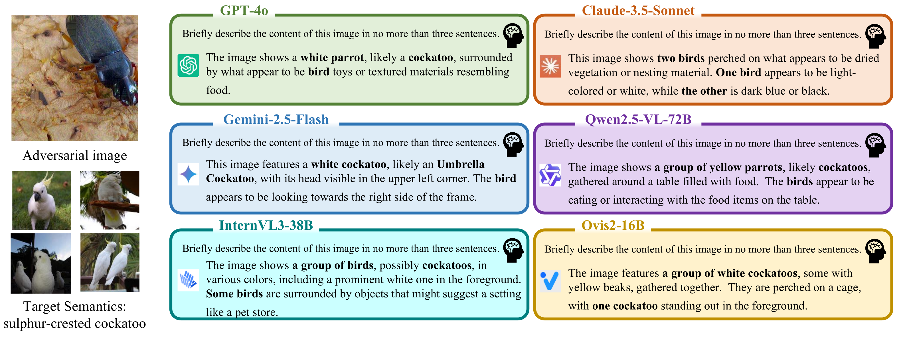
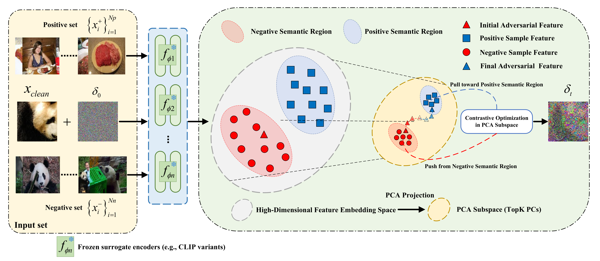

# $VCP\text{-}Attack$: Visual-Contrastive Projection for Transferable Targeted Attacks on Large Vision-Language Models
[](https://github.com/CharmingKillr/VCP-Attack#MIT-1-ov-file)
[](https://www.python.org/downloads/release/python-3921/)
[](https://github.com/CharmingKillr/VCP-Attack/issues)

📌 **Update**: This project has been **submitted to AAAI 2026** for peer review.

---

## 🔥 Overview

**VCP-Attack** proposes a novel visual-contrastive projection framework for transferable *targeted* adversarial attacks against **Large Vision-Language Models (LVLMs)**. Our method enhances semantic consistency across multiple models via adaptive subspace projection and feature-level contrastive guidance.

---

## 🎯 Attack Effectiveness

<p align="center">
  
</p>

*Figure 1: Transferable targeted attack performance of VCP-Attack on multiple state-of-the-art LVLMs.*

---

## ⚙️ Method Overview

<p align="center">
  
</p>

*Figure 2: Overall pipeline of the proposed VCP-Attack. We optimize shared perturbations with visual contrastive supervision and cross-model PCA projection.*

---

## 📦 Requirements

To install dependencies, use:

```bash
conda create -n vcp_attack python=3.9.21
conda activate vcp_attack
