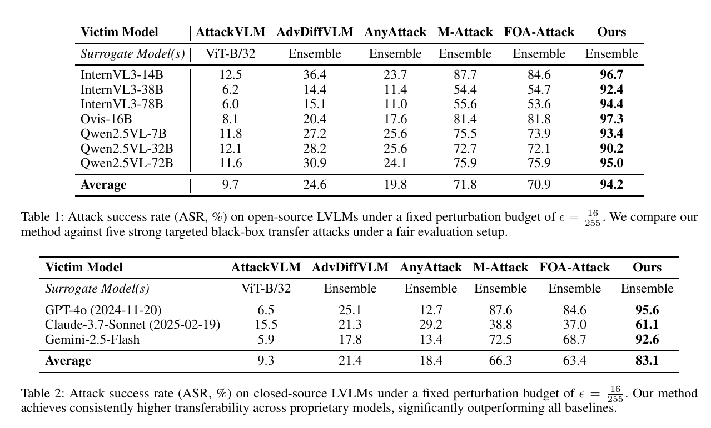
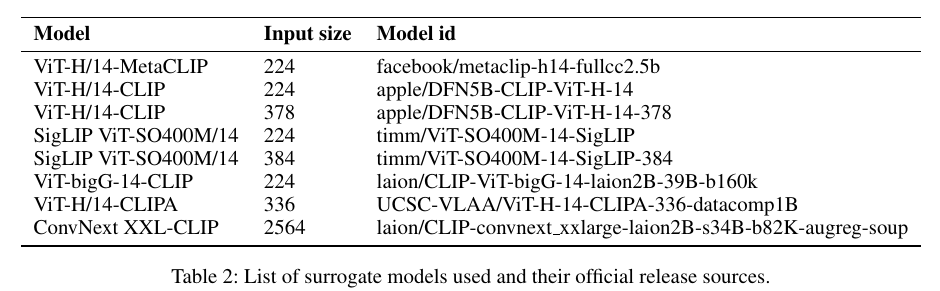

# $VCP\text{-}Attack$: Visual-Contrastive Projection for Transferable Targeted Attacks on Large Vision-Language Models
[](https://github.com/CharmingKillr/VCP-Attack#MIT-1-ov-file)
[](https://www.python.org/downloads/release/python-3921/)
[](https://github.com/CharmingKillr/VCP-Attack/issues)

📌 **Update**: This project has been **submitted to AAAI 2026** for peer review.

---

## 🔥 Overview

**VCP-Attack** proposes a novel visual-contrastive projection framework for transferable *targeted* adversarial attacks against **Large Vision-Language Models (LVLMs)**.  
Our method enhances semantic consistency across multiple models via adaptive subspace projection and feature-level contrastive guidance.

---

## 🎯 Attack Effectiveness

<p align="center">
  
</p>

*Figure 1: Transferable targeted attack performance of VCP-Attack on multiple state-of-the-art LVLMs.*

---

## 📊 Quantitative Results (Table)

<p align="center">
  
</p>

*Figure 2: Attack success rates across open- and closed-source LVLMs.*

---

## 🖼️ Adversarial Sample Visualization

<p align="center">
  
</p>

*Figure 3: Comparison of adversarial examples generated by different methods. Our VCP-Attack yields semantically aligned and transferable perturbations.*

---

## ⚙️ Method Overview

<p align="center">
  
</p>

*Figure 4: Overall pipeline of the proposed VCP-Attack. We optimize shared perturbations with visual contrastive supervision and cross-model PCA projection.*

---

## 📦 Requirements

To install dependencies, use:

```bash
conda create -n vcp_attack python=3.9.21
conda activate vcp_attack
pip install -r requirements.txt
```

## 🚀 Running the Attack
To run the attack pipeline, make sure you have prepared both the datasets and the surrogate models as follows:

---
### 📂 Required Dataset
We use two datasets in our attack pipeline:
#### 1. NIPS 2017 Adversarial Attack Dataset
We use 1,000 clean images from the [**NIPS 2017 Adversarial Attack and Defense Competition**], which is based on ImageNet.
- 🔗 Download link (Kaggle):  
  https://tianchi.aliyun.com/dataset/88668
These serve as clean input images to be attacked.
---
#### 2. ImageNet-1K Validation Set (Reference Pool)
We use the full [**ImageNet-1K validation set**](50,000 images) as a reference pool for contrastive supervision.
- 🔗 Download link (Kaggle):  
  https://www.kaggle.com/datasets/sautkin/imagenet1kvalid
- 🔧 Preprocess the downloaded images using:
```bash
python tools/process_imagenet.py
```

---
### 🤖 Required Surrogate Models
Our method relies on an ensemble of frozen CLIP-based vision encoders. (Models can be auto-downloaded or loaded from local path by setting config.)
<p align="center">
  
</p>

```bash
python vcp_attack.py
```
---
## 🧪 Evaluation
```bash
cd evaluation
python _internVL3-14b_img2txt.py --img_path your generated adversarial examples path --output_path output txt path --txt_name txt name #(model you want to evaluate)# 
python evaluate_captions_1000.py --attack_text_path your txt path --output_path your output path
```
## 🙏 Acknowledgements
We gratefully acknowledge the open-source community and previous research efforts for their invaluable contributions. This project builds upon the foundations laid by the following works:
- [**OpenCLIP**](https://github.com/mlfoundations/open_clip)
- [**HuggingFace**](https://github.com/huggingface) 
- [**AnyAttack**](https://github.com/jiamingzhang94/AnyAttack)
- [**M-Attack**](https://github.com/VILA-Lab/M-Attack) 
- [**FOA-Attack**](https://github.com/jiaxiaojunQAQ/FOA-Attack)
- [**AdvDiffVLM**](https://github.com/gq-max/AdvDiffVLM) 
- [**AttackVLM**](https://github.com/yunqing-me/AttackVLM)
